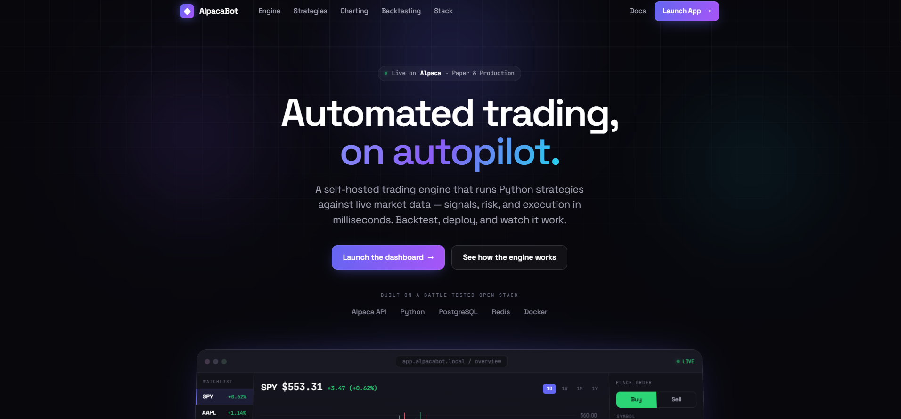
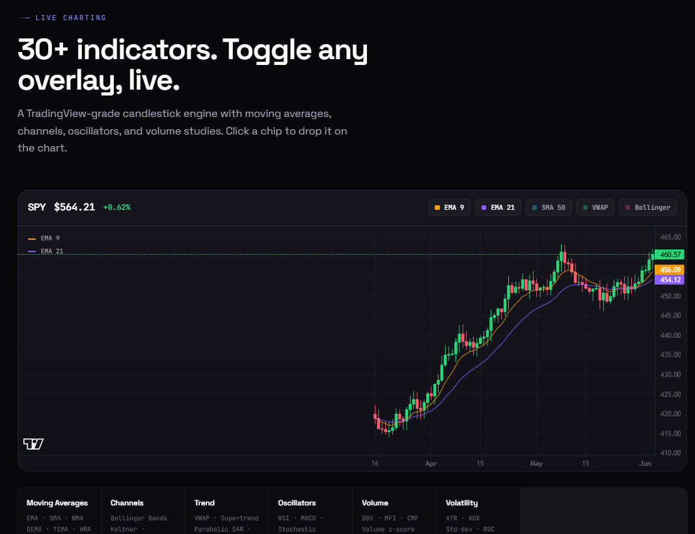
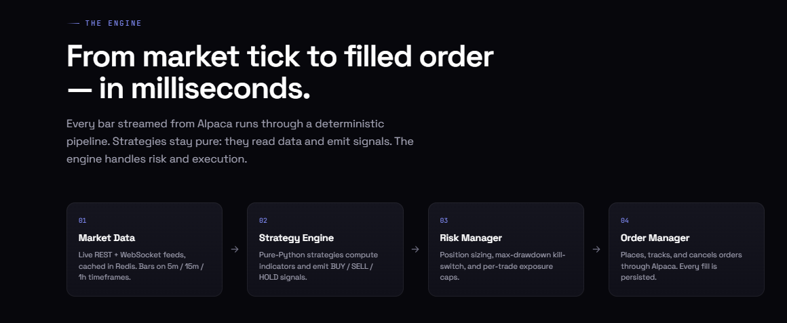
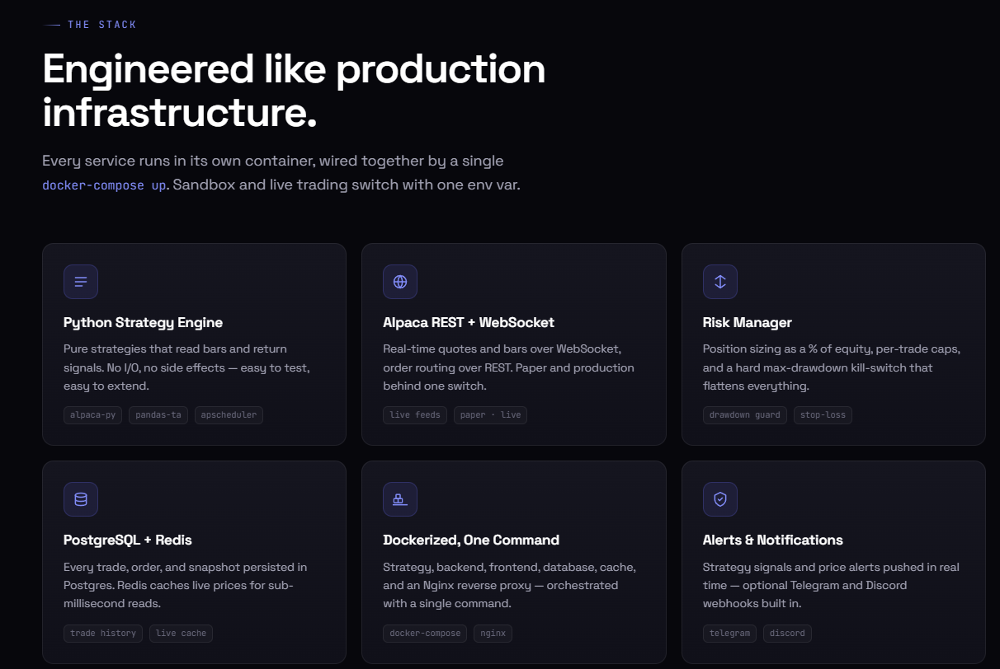
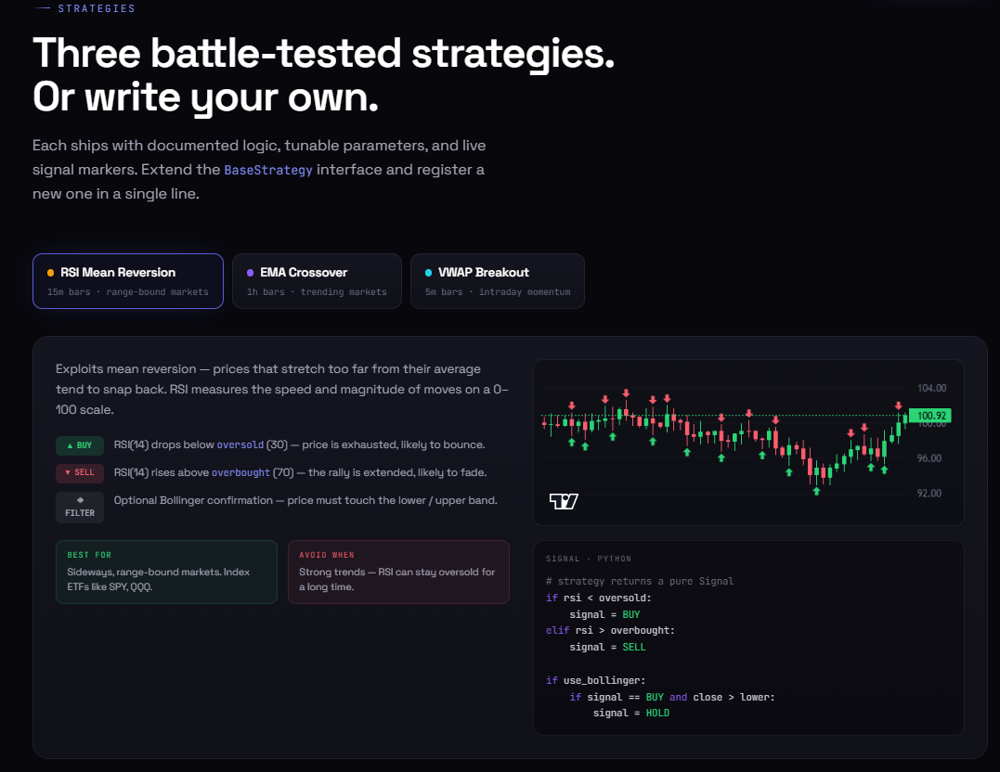

# Alpaca Trading Bot

## Home Page


## Dashboard







Automated trading bot platform with:
- Python strategy engine (`strategy/`)
- Node.js backend API + WebSocket relay (`backend/`)
- React dashboard (`frontend/`)
- PostgreSQL + Redis + Nginx via Docker Compose

## Tech Stack

- **Strategy:** Python 3.12, `alpaca-py`, `apscheduler`, `pandas`, `langgraph`, `openai`
- **Backend:** Node.js 20, Express, Socket.IO, Redis, PostgreSQL (`pg`)
- **Frontend:** React + TypeScript + Vite + TailwindCSS + `lightweight-charts` + Recharts
- **AI Pipeline:** LangGraph `StateGraph`, `gpt-4o-mini`, Pydantic structured output
- **Scanners:** Waterfall (6-stage, S&P 100 + ETFs) + Momentum (5-stage, live movers)
- **Infra:** Docker Compose, Nginx reverse proxy



## Repository Structure

```text
.
├── strategy/         # Trading engine and strategies
├── backend/          # REST API, auth, WebSocket relay
├── frontend/         # Dashboard UI
├── db/               # PostgreSQL schema bootstrap
├── nginx/            # Reverse proxy config
├── docker-compose.yml
└── docker-compose.prod.yml
```

## Prerequisites

- Docker Desktop (recommended)
- Or local runtimes: Python 3.12+, Node.js 20+, PostgreSQL, Redis

## Quick Start (Docker)

1. Copy env template:

```bash
cp .env.example .env
```

2. Update `.env` with your Alpaca keys and secrets.

3. Start all services:

```bash
docker compose up --build
```

4. Open apps:
- `http://localhost` (via Nginx)
- `http://localhost:3000` (frontend dev)
- `http://localhost:8000/health` (backend health)

## Common Commands

```bash
# Stop services
docker compose down

# Follow logs
docker compose logs -f

# Run strategy tests in container
docker compose run --rm strategy python -m pytest tests -v

# Start with production overrides
docker compose -f docker-compose.yml -f docker-compose.prod.yml up --build -d
```

If you use the `Makefile`, equivalent shortcuts are available:

```bash
make up
make down
make logs
make test
make prod-up
```

## Environment Variables

Key variables (see `.env.example` for full list):

- `ALPACA_MODE` (`sandbox` or `production`)
- `ALPACA_PAPER_API_KEY`, `ALPACA_PAPER_SECRET_KEY`
- `ALPACA_LIVE_API_KEY`, `ALPACA_LIVE_SECRET_KEY`
- `BACKEND_PORT`, `FRONTEND_PORT`
- `POSTGRES_*`, `REDIS_*`
- `DEFAULT_STRATEGIES`, `MAX_POSITION_SIZE_PCT`, `MAX_DRAWDOWN_PCT`

## Strategy Notes

Built-in strategies:
- **RSI Mean Reversion** — 15m bars, RSI(14) oversold/overbought with optional Bollinger confirmation
- **EMA Crossover** — 1h bars, EMA(9) vs EMA(21) with volume confirmation
- **VWAP Breakout** — 5m bars, price above VWAP with volume z-score > 1.5

All strategy signals are executed through `strategy/broker/order_manager.py`.

## AI Agent Pipeline (LangGraph)

Six agents wired into a `StateGraph`. Runs on schedule or via `POST /api/agent/run`:

| Agent | Output | Cost |
|---|---|---|
| MarketDataFetcher | `market_snapshots` | free |
| DataQA | `qa_result` | free |
| NewsFetcher | `news_snapshots` | free |
| NewsAnalysis | `news_sentiments` | ~$0.01 |
| SignalSelection | `signal_selections` | ~$0.01 |
| RiskAllocation | `risk_allocations` | ~$0.01 |

## Scanners

| Scanner | Universe | Stages | Use case |
|---|---|---|---|
| **Waterfall** | S&P 100 + ETFs (~110) | 6 | Technical setups, swing trades |
| **Momentum** | Live movers (dynamic) | 5 | Catalyst-driven intraday (20–90 min) |

Run via Scanner page → "Run Scan" or `POST /api/scanner/run` / `POST /api/momentum/run`.



## Security Notes

- Do not commit real API keys or secrets.
- Keep `.env` local only.
- Rotate keys if they were ever exposed.

## Development Notes

- Backend routes are under `backend/src/routes/`.
- Frontend pages are under `frontend/src/pages/`.
- Strategy scheduling entrypoint: `strategy/main.py`.
- Health endpoint: `GET /health` on backend.

## License

Internal/project-specific unless otherwise specified.
